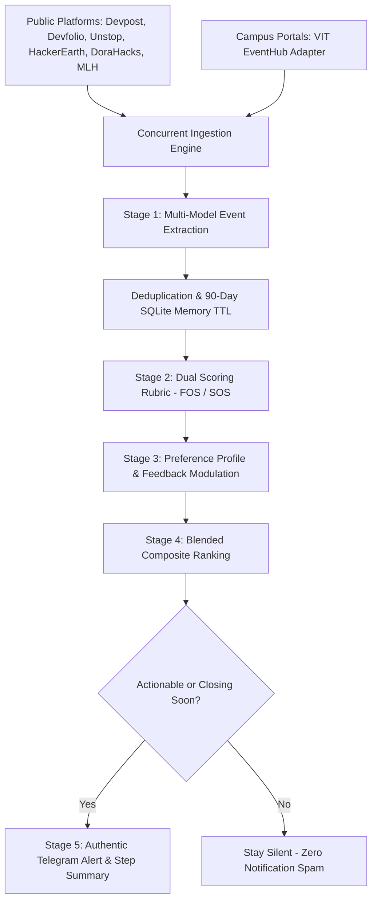

# 🎯 Hackathon & Opportunity Intelligence Agent

[](https://github.com/pr6thv3/hackathon-monitor/actions/workflows/test.yml)
[](https://github.com/pr6thv3/hackathon-monitor/actions/workflows/schedule.yml)


An autonomous, multi-source intelligence agent that discovers, filters, evaluates, and alerts you to high-yield hackathons and tech competitions matching your exact builder profile—with zero notification spam.

---

## What It Does & Why It Matters

Engineering students and technical builders miss out on lucrative hackathons, grant pools, and student workshops because opportunity listings are fragmented across dozens of disconnected platforms. Manually checking each platform leads to search fatigue, missed application deadlines, and wasted effort on low-quality events.

**Hackathon Monitor** solves this by automating the entire discovery and evaluation lifecycle:
1. **Aggregates** technical events concurrently across major platforms and private campus portals.
2. **Evaluates** each event using dual scoring frameworks (Founder Opportunity Score vs. Student Opportunity Score) powered by Groq LPU inference and Gemini.
3. **Matches** opportunities against your personal builder preferences using dynamic relevance scoring and a behavioral feedback loop.
4. **Delivers** authentic, human-style Telegram check-ins and Markdown summaries on a periodic bi-weekly schedule—staying completely silent when no high-value updates exist.



---

## Features

- **Concurrent Multi-Source Scraping** — Polling Devpost, Devfolio, Unstop, HackerEarth, DoraHacks, MLH, and authenticated college portals concurrently via Playwright and REST endpoints, reducing scraping latency to seconds.
- **Dual Scoring Frameworks (FOS & SOS)** — Evaluates opportunities using specialized rubrics: **Founder Opportunity Score (FOS)** for venture hackathons (sponsor tier, hiring upside, grant potential) and **Student Opportunity Score (SOS)** for campus buildathons (learning value, skill development, network).
- **Multi-Model LLM Engine** — Leverages ultra-fast Groq LPU inference (`openai/gpt-oss-120b`, `llama-3.3-70b`) for rapid analysis, with automatic fallback to Google Gemini 2.5 Flash.
- **Personalized Relevance Matching** — Parses natural language preferences from `config.yaml` into structured interest vectors, ranking opportunities based on direct alignment with your tech stack.
- **Behavioral Feedback Reinforcement** — Dynamically adjusts future topic weights when you interact with opportunities (`applied`, `opened`, `bookmarked`, `dismissed`).
- **Composite Priority Ranking** — Ranks qualifying opportunities using a blended formula balancing relevance (50%), opportunity score (30%), win probability (20%), deadline urgency, and application link availability:
  $$\text{Composite Rank} = (0.5 \times \text{Relevance} + 0.3 \times \text{OppScore} + 0.2 \times \text{EasyWin}) \times \text{Urgency} \times \text{LinkPenalty}$$
- **Authentic, Anti-Spam Notifications** — Dispatches clean, concise Telegram check-ins with urgency indicators (`⚡ ≤7d`, `🔥 ≤30d`, `📌 >30d`) and one-tap application buttons. Remains completely silent when no actionable updates exist.
- **Stateful Memory & Deduplication** — Tracks events in an SQLite database (`data/monitor.db`) with automated 90-day TTL cleanup and Git-synced state (`seen_events.json`) for CI/CD runners.

---

## Tech Stack

| Category | Technologies |
|---|---|
| **Runtime & Language** | Python 3.10+, Pydantic v2, PyYAML |
| **AI & LLM Inference** | Groq Cloud SDK (`openai/gpt-oss-120b`), Google GenAI SDK (`gemini-2.5-flash`) |
| **Web Ingestion & Scraping** | Playwright (Headless Chromium), BeautifulSoup4, HTTPX, Requests |
| **Database & Persistence** | SQLite 3 (`data/monitor.db`), JSON memory cache (`seen_events.json`) |
| **CI/CD & Automation** | GitHub Actions (Scheduled cron pipelines, `workflow_dispatch`, Step Summaries) |
| **Testing** | Pytest (33 unit and end-to-end integration tests), Pytest-asyncio |
| **Delivery & Reporting** | Telegram Bot API (HTML parse mode, inline keyboard markups), Markdown reports |

---

## Getting Started

### Prerequisites

- **Python**: Version 3.10 or higher
- **Playwright Chromium**: Required for dynamic SPA rendering
- **API Keys**:
  - Groq API Key (from [console.groq.com](https://console.groq.com/)) or Google Gemini API Key (from [aistudio.google.com](https://aistudio.google.com/))
  - Telegram Bot Token & Chat ID (from `@BotFather` and `@userinfobot`)

### Installation

```bash
# 1. Clone the repository
git clone https://github.com/pr6thv3/hackathon-monitor.git
cd hackathon-monitor

# 2. Create and activate a virtual environment
python3 -m venv .venv
source .venv/bin/activate  # On Windows: .venv\Scripts\activate

# 3. Install dependencies
pip install -r requirements.txt

# 4. Install Playwright browser binaries
playwright install chromium --with-deps
```

### Environment Variables

Copy the example environment template:

```bash
cp .env.example .env
```

Configure the following variables in `.env`:

| Variable | Description | Required? |
|---|---|---|
| `GROQ_API_KEY` | Groq API Key for fast LPU evaluation (`gsk_...`) | Recommended (Primary) |
| `GEMINI_API_KEY` | Google Gemini API Key | Recommended (Fallback) |
| `TELEGRAM_BOT_TOKEN` | Bot authorization token from `@BotFather` | Required for Telegram delivery |
| `TELEGRAM_CHAT_ID` | Your personal or group Telegram Chat ID | Required for Telegram delivery |
| `VIT_USERNAME` | Student registration number/email for campus portal | Optional (VIT EventHub) |
| `VIT_PASSWORD` | Password for campus portal authentication | Optional (VIT EventHub) |
| `GITHUB_TOKEN` | GitHub Personal Access Token (PAT) | Optional (Raises API rate limits) |

### Running Locally

```bash
# Run dry-run (scrapes, scores, ranks, and previews message without sending alerts)
python main.py --dry-run

# Run live pipeline (scrapes, scores, and delivers Telegram alert if qualifying events exist)
python main.py
```

### Verification

Run the automated test suite to verify extraction, scoring logic, adapters, and notifier resilience:

```bash
pytest tests/ -v
```

All 33 unit and integration tests should pass.

---

## Usage

### CLI Utilities

```bash
# View database statistics and user feedback counts
python main.py --stats

# List recent opportunities stored in the local SQLite database
python main.py --list-events

# Record user feedback to adjust personalized weighting
python main.py --feedback <EVENT_ID> <applied|opened|bookmarked|dismissed>
# Example:
python main.py --feedback 14 applied

# Force re-evaluation of all events (bypasses memory deduplication)
python main.py --force --dry-run
```

### Scheduled GitHub Actions Automation

The repository includes an autonomous GitHub Actions workflow ([`.github/workflows/schedule.yml`](.github/workflows/schedule.yml)) running on a **twice-weekly cadence: Mondays and Thursdays at 8:00 AM UTC (1:30 PM IST)** (`0 8 * * 1,4`).

- **Monday Run**: Captures new hackathons and competition announcements launched over the weekend.
- **Thursday Run**: Flags final-call registration deadlines ahead of the weekend.
- **Zero-Spam Behavior**: If no new high-value opportunities exist and no deadlines are closing within 7 days, the workflow completes silently without triggering Telegram messages.

#### Modifying the Schedule

To change the run frequency, update the cron expression in line 13 of `.github/workflows/schedule.yml`:

```yaml
on:
  schedule:
    - cron: '0 8 * * 1,4'  # Monday & Thursday at 8:00 AM UTC (1:30 PM IST)
```

| Schedule Frequency | Cron Expression | Use Case |
|---|---|---|
| **Twice Weekly (Default)** | `'0 8 * * 1,4'` | Monday & Thursday check-in (Recommended) |
| **Weekly** | `'0 8 * * 1'` | Every Monday morning |
| **Every 3 Days** | `'0 8 */3 * *'` | Every 72 hours |
| **Every 5 Days** | `'0 8 */5 * *'` | Low-frequency periodic check-in |

#### Manual Trigger

You can trigger the workflow manually at any time:
1. Navigate to the **Actions** tab in your GitHub repository.
2. Select **Scheduled Hackathon & Opportunity Intelligence Agent**.
3. Click **Run workflow** > **Run workflow**.

---

## Project Structure

```text
├── .github/
│   └── workflows/
│       ├── schedule.yml             # Scheduled cron & workflow dispatch pipeline
│       └── test.yml                 # Automated Pytest CI workflow
├── config.yaml                      # User profile & portal preferences
├── data/
│   └── monitor.db                   # Relational SQLite database
├── reports/                         # Generated Markdown digest reports
├── src/
│   ├── adapters/
│   │   ├── base.py                  # CollegePortalAdapter abstract base class
│   │   ├── vit.py                   # VIT EventHub adapter with session caching
│   │   └── generic.py               # Generic Playwright card adapter
│   ├── brain.py                     # Multi-model AI pipeline (Groq 120B / Gemini)
│   ├── config.py                    # YAML config loader & LLM preference parser
│   ├── db.py                        # SQLite relational engine & JSON sync
│   ├── feedback.py                  # User feedback & weight modulation
│   ├── fetcher_college.py           # College adapter gateway
│   ├── fetcher_devfolio.py          # Devfolio API + Playwright
│   ├── fetcher_devpost.py           # Devpost API + DOM card extraction
│   ├── fetcher_dorahacks.py         # DoraHacks API + Playwright
│   ├── fetcher_hackerearth.py       # HackerEarth upcoming API + Playwright
│   ├── fetcher_mlh.py               # MLH static HTML scraper
│   ├── fetcher_unstop.py            # Unstop API + Playwright
│   ├── git_status.py                # Repository status & metrics inspection
│   ├── github_intel.py              # GitHub ecosystem scanner
│   ├── health.py                    # Source health tracker & metrics
│   ├── memory.py                    # Deduplication & 90-day TTL expiry
│   ├── notifier.py                  # Mobile-optimized Telegram delivery
│   └── report.py                    # Markdown digest report generator
├── tests/                           # Pytest test suite (33 unit & E2E tests)
├── main.py                          # Main orchestrator & CLI entry point
├── seen_events.json                 # Auto-committed deduplication memory
└── requirements.txt                 # Project dependencies
```

---

## Contributing

Contributions are welcome! To contribute:

1. **Fork the repository** on GitHub.
2. **Clone your fork** locally:
   ```bash
   git clone https://github.com/<your-username>/hackathon-monitor.git
   cd hackathon-monitor
   ```
3. **Create a development branch**:
   ```bash
   git checkout -b feature/your-feature-name
   ```
4. **Install dependencies and test setup**:
   ```bash
   pip install -r requirements.txt
   playwright install chromium --with-deps
   ```
5. **Implement changes and run tests**:
   ```bash
   pytest tests/ -v
   ```
6. **Commit your changes**:
   ```bash
   git commit -m "feat: add new challenge adapter for XYZ"
   ```
7. **Push to your fork and submit a Pull Request**:
   ```bash
   git push origin feature/your-feature-name
   ```

Please ensure all existing tests pass and add unit tests for new platform adapters or scoring features.

---

## License

No open-source license is currently detected in this repository. All rights are reserved by the repository owner.

> **Recommendation**: To enable open-source collaboration, consider adding an **[MIT License](https://choosealicense.com/licenses/mit/)** (permissive for widespread developer adoption) or an **[Apache 2.0 License](https://choosealicense.com/licenses/apache-2.0/)** (includes contributor patent grants). The final choice rests with the repository owner.
